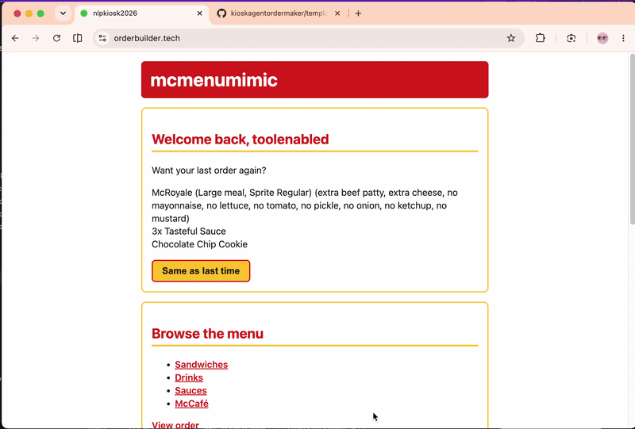

# OrderBuilder — AI Kiosk Order Agent

A McDonald's-style self-service kiosk where the **same order can be built two ways**: by clicking through a touch-screen menu, or by talking to an AI agent in plain English. The two surfaces are bridged by a short pickup code — the agent assembles an order, locks it into a 4-character code, and the kiosk redeems that code straight to checkout. The whole app is built to adapt to a single editable menu file: add an item to the JSON and both the web kiosk and the AI agent pick it up without code changes.

## Two Ways to Build One Order

| Manual kiosk | AI order builder |
|:---:|:---:|
|  |  |
| Click through categories → customize → cart | One sentence → agent assembles, confirms, finalizes |

---

## Features and Design

- Easily adjustable JSON menu file that the web app and the LLM both adapt to
- Adjustable tax rate and strict type checking using Pydantic schemas
- Item customization for sandwich ingredients, meal sizing, drinks, and quantities
- Access the AI order section by scanning a QR code or tapping through the web app
- Redemption codes generated by the AI that the customer obtains on their phone and plugs into the kiosk
- Holds live, non-static state — cart, AI chat, redemption codes — per anonymous browser session, no login required
- AI order-builder agent powered by LangChain and OpenRouter-compatible chat models
- Server-side cloud deployment on a DigitalOcean droplet, managed over SSH
- SQLite persistence for order analytics covering both LLM and customer behaviour
- Email registration and verification using Resend
- JWT cookie login with a "reorder last redeemed order" flow

---

## How the Ordering Flow Works

**Manual kiosk flow**

The familiar path. Browse the menu, customize an item, watch it land in your cart, priced and ready. Everything you build is held against your browser session, so there's no sign-in between you and food.

```text
User checks the menu
      │
      ▼
User adds the items interactively
      │
      ▼
User sees the items in the checkout
```

**AI order builder flow**

The same order, spoken instead of tapped. The customer scans the QR code to open a chat page and tells the agent what they want; it assembles the order and reads it back, and once the customer says yes it hands them a short 4-character hexadecimal pickup code. Type that code into the kiosk screen and the whole order drops into the cart, straight to checkout.

```text
AI chat assembles order
      │  (view_order → readback → explicit "yes")
      ▼
finalize_order → 4-hex pickup code  ──►  PENDING_ORDERS (in-memory, 60s TTL)
      │                                          │
      │                                   kiosk /redeem looks up code
      ▼                                          ▼
SQLite analytics row                      cart loaded → checkout
```

---

## Project Structure

```text
.
|-- mainfast.py              # FastAPI app, routes, session/cart handling
|-- llmagent.py              # LangChain model setup, tools binding, agent loop
|-- llmtools.py              # Tool functions used by the AI order builder
|-- datapydentic.py          # Pydantic menu and order models
|-- totaling.py              # Pricing and tax calculations
|-- sqlmanager.py            # SQLite schema and query helpers
|-- jwtmanager.py            # Password hashing and JWT helpers
|-- emailmanager.py          # Resend verification email sender
|-- mcmenu.json              # Menu data which is flexible to addition
|-- templates/               # Jinja2 html pages
|-- static/                  # CSS and static assets
|-- tests/                   # Exploratory/manual test scripts
|-- evaluations/             # Manual eval rounds — results and analysis
|-- screenshots/             # README screenshots and demo gifs
`-- documentation/           # Notes, deployment docs, and planning artifacts
```

## API Routes & State

**What the app remembers (without asking who you are)**
This isn't a static site — it holds three kinds of live state, none of which need a login. Everything hangs off one anonymous `session_id` cookie that identifies a browser (not a person) and quietly carries two things at once: your AI chat and your kiosk cart, side by side under the same visit. The third is the pickup code an AI order finalizes into — held briefly in memory with a 60-second life, just long enough to walk it to the kiosk and redeem it. Logging in is a separate layer on top of all this (its own `auth_token` cookie, detailed further down) — it adds identity, but you can order start to finish without ever creating an account.

**Routes**

```text
# Kiosk
/                  # landing page — menu, code redemption, welcome-back
/customize/*       # build and tweak an item's ingredients, size, meal
/order             # the cart, priced and ready for checkout

# AI
/orderai           # natural-language ordering with the agent

# Bridge
/redeem            # turn a pickup code into a loaded kiosk cart
/reorder           # one-tap "same as last time"

# Auth
/register          # sign-up
/verify            # email-code verification
/login             # start a session
/logout            # end it
/settings          # nickname editing — the only login-gated page

# JSON
/api/menu          # the menu, as the app sees it
/api/order         # read-only view of the current cart
```

---

## AI Agent: Behavior, Tools, and the Run Loop

**The behavior:** the agent is built to feel like a sharp human cashier — it understands what you mean, not just what you type. The rules it works under:

**Rules it follows:**

- "extra X" adds one, and stacks: "extra extra" adds two.
- "no X" / "without X" means none, when the item allows it.
- "only X, extra X" strips every topping except X, then bumps X by one.
- Ingredient counts are capped at 5 — ask for more and it politely won't.
- Prices are always in Saudi Riyals.
- As a guardrail, it requires an explicit yes before finalizing the order.

**The tools:**

The agent has **9 tools, 7 that write and 2 that read**:

#### Write / mutate the order

```text
add_sandwich    # add a sandwich, with any ingredient changes
add_drink       # add a standalone drink in a chosen size
add_water       # add a flat-price bottle of water
add_sauce       # add a dipping sauce
add_mccafe      # add a McCafé item
remove_item     # drop one item by its position
clear_order     # empty the cart
```

#### Read / terminal

```text
view_order      # read the current cart — the agent's source of truth
finalize_order  # lock the order and issue a 4-char pickup code
```

**The run:**

```text
user message
   │
   ▼
┌─────────────────────────────┐
│  ask the model              │◄──────────┐
└─────────────────────────────┘           │
   │                                       │
   ├─ wants tools? ─ yes ─► run them ──────┘
   │                        (feed results back)
   │
   └─ plain text? ─► that's the reply
```

Each user message runs through a hand-rolled loop — the model calls tools, sees the results, and calls more until it's ready to reply in plain text. A hard cap on loops per turn keeps a confused model from spinning forever and burning tokens; hit the cap and it bails gracefully instead.

---

## Evaluation

The agent went through **two manual eval rounds of 15 prompts each** — not a test suite, but structured runs probing what matters: refusals, ingredient math, the cap rule, meal edits, and the confirm-gate. Every readback was logged, then rows read by hand to see what broke and whether the next round fixed it.

| Round 1 caught | Round 2 confirmed |
|---|---|
| **Currency leak** — model composed a price table in dollars instead of riyals. Fixed with a one-line prompt declaration. | **Currency fix held** — riyals everywhere, including model-composed math. |
| **Compound edits shaky** — "only cheese, extra cheese" needed a couple of correction passes to land. | **Ingredient logic correct** — "extra extra extra cheese" capped at five, "double cheese" to one extra, defaults untouched, remove/clear/meal-swap clean. |
| **Finalize-gate slip** — on a complex multi-edit turn, the model moved to lock without an explicit yes. | **Refusals deterministic** — out-of-scope and over-max return stable text, letting the flag system match by string with no dedicated tool. |

---

## Cloud Deployment

Getting this live was its own small odyssey. The first instinct was Google Cloud — turned out to be business-only for what I needed. Firebase next: great for the front end, hosted a static build fine, but no real backend story for a FastAPI app with a live agent loop. Hugging Face Spaces after that. It finally landed on a **DigitalOcean droplet** — a 1GB Ubuntu 24.04 box in Bangalore, the closest region to me — and that's where it runs today.

The architecture on the box is built around one invariant: **state must survive a deploy.** That's enforced by keeping four things in four separate places, and only one of them is the repo:

```text
/srv/orderbuilder/kioskagentordermaker   # the code — the only thing a deploy touches
/srv/orderbuilder/data/kioskorders.db    # the database — kept outside the code
/etc/orderbuilder/app.env                # the secrets — root-owned, locked down
/srv/orderbuilder/backups/               # nightly snapshots of the database
```

And the data is backed up like it matters: a cron job runs a SQLite hot-backup nightly at 03:30 UTC, keeps the 7 most recent snapshots and rotates the rest, logs each run, and before any risky change I pull a copy *off* the droplet to my local machine — so the data outlives the droplet itself if it ever gets destroyed.

**Updating the app** is genuinely just `git pull && systemctl restart orderbuilder`. Because the database and secrets live outside the working tree, a deploy can never clobber data or leak a key — and the app finds its database through a path variable (`KIOSK_DB_PATH`), so the code never hard-codes where data lives.

**Only three doors are open.** A firewall (`ufw`) allows in just three ports and drops everything else.

The app itself listens on `127.0.0.1:8000` — bound to localhost, so it's not reachable from the outside world at all. The app runs as two Uvicorn workers under a Gunicorn master — Gunicorn owns the worker pool. The only public path to it runs through **nginx** on 443, which terminates TLS (Let's Encrypt, auto-renewed by Certbot) and proxies to the local app. There's no way to skip the proxy and hit the app port directly: it's private by binding *and* closed at the firewall, with nginx as the single hardened front door. The whole thing runs under **systemd** as an unprivileged `orderbuilder` user — never as root.

```text
22   # SSH — how I get in to deploy
80   # HTTP — redirects to HTTPS, and lets Certbot renew the certificate
443  # HTTPS — the actual public traffic, TLS-terminated at nginx
```

---

## Data Persistence, Observability and Security

**orders table schema:**

```text
id                 # row id — autoincrement, insertion order
created_at         # UTC timestamp (ISO-8601), stamped at insert
user_message       # what the customer said
assistant_reply    # what the agent said back
order_json         # the full assembled cart
prompt_tokens      # tokens in — per AI turn
completion_tokens  # tokens out — per AI turn
loop_count         # tool-call rounds that turn took
wall_clock_ms      # how long the turn took
code               # the pickup code, once finalized
redeemed           # whether it was ever picked up
user_email         # stamped only when a logged-in user redeems
FLAG               # marks special turns (e.g. refusals:out_of_scope, over_max)

```

**users table schema:**

```text
email              # the account — primary key
password_hash      # argon2, never the password itself
nickname           # optional display name
created_at         # UTC timestamp (ISO-8601), set at sign-up
email_verified     # gate — unverified can't log in
verification_code  # 6-digit, short-lived
code_expires_at    # when that code dies
```

### Flagging
The FLAG column provides lightweight observability for exceptional turns. Automatic flags currently cover out-of-scope requests and ingredient-limit violations, while the same column can also be used for manual analysis labels.

### Every AI turn is a row, so the table answers real questions with plain SQL
This enables LLM–consumer behavior analysis and prediction. Every row carries its exact assembled order as JSON, so order-frequency stats are a short Python pass away and agent-side questions (effort, latency) are each one query off — no separate pipeline.

**Examples:**

Everything a given customer ever ordered:

```sql
SELECT * FROM orders WHERE user_email = 'sam@example.com';
```

Turns where the model struggled (lots of tool-call rounds):

```sql
SELECT * FROM orders WHERE loop_count > 6 ORDER BY loop_count DESC;
```

The slow ones, for latency analysis:

```sql
SELECT * FROM orders WHERE wall_clock_ms > 8000 ORDER BY wall_clock_ms DESC;
```

Find a specific assembled cart:

```sql
SELECT * FROM orders WHERE order_json = '...';
```

Count the orders that were flagged:

```sql
SELECT COUNT(*) FROM orders WHERE FLAG IS NOT NULL;
```

Count the orders flagged for hitting the ingredient cap:

```sql
SELECT COUNT(*) FROM orders WHERE FLAG = 'over_max';
```
Count the orders flagged for being irrelevant to the agent's task:

```sql
SELECT COUNT(*) FROM orders WHERE FLAG = 'out_of_scope';
```

All of this — orders and user records alike — lives securely in a single SQLite file on the droplet, kept outside the repo and never committed. It's nobody's data but the project's: not synced to a third party, not bundled into the deploy, and leaving the box only in backups pulled down over SSH.

---

## Login / Signup System

An auth system that pays off the moment you return: redeem an order while signed in and it's stamped to you — which powers **welcome-back**, the one-tap "same as last time" that reloads your last order straight into the cart.

### Email verification code upon sign-up
`admin@orderbuilder.tech` sends a 6-digit verification code via Resend, from a domain I set up and verified myself by configuring its email DNS records. The account stays locked until the code is confirmed — no logging in unverified, even with the right password.

### Security measures
**Enumeration defense:**
Register an email that's already taken and the system says nothing different — no way to probe it for who has an account. Wrong password and unknown user get the exact same reply.

**Passwords are argon2-hashed:**
Argon2 hashing provides the modern, memory-hard standard built to resist GPU cracking.

---

## Managing Secrets

**example.env**

```text
kioskagentapikey=aaaaaaaaaaaaaaaaaaaaaaaaaa
kioskagentapikey2=bbbbbbbbbbbbbbbbbbbbbbbbbb
jwt_secret_key=ccccccccccccccccccccccccccc
resendapikey=ddddddddddddddddddddddddddd
```

> **Note on the two LLM key slots:** this project required a *paid* API key. The second slot holds the older free experimental Groq key the agent started on — its credits simply don't suffice for a tool-calling agent that makes several model calls per turn.

Three secrets run this app: the LLM key, the JWT signing secret, and the email key — and none of them has ever been in the repo. Locally they live in a single gitignored env file; each module loads only the key it needs.

In production, the secrets file lives entirely outside the deployed code — so a deploy can never touch it. (More above in Deployment.)

The same care extends to the tooling: `.claude/settings.json` — a shared file in the repo — explicitly tells the coding agent not to access any file ending in `.env`.

> Note: the settings.json is deliberately **not** gitignored, to showcase real secret handling in modern agentic development environments. Another way to deal with this in production is to externally isolate the .env files.

---

## Tech Stack

| Layer | Choice |
|---|---|
| Web framework | FastAPI + Jinja2 |
| Data models | Pydantic (discriminated `OrderItem` union) |
| Agent | Custom LangChain loop |
| LLM | OpenRouter — `openai/gpt-oss-120b` |
| Persistence | SQLite (analytics + users) |
| Auth | argon2-cffi (hashing) · PyJWT HS256 |
| Email | Resend (Amazon SES) |
| Hosting | DigitalOcean · nginx · Gunicorn/Uvicorn · systemd · Certbot |

---

## Lessons & Future Work

**Knowing when *not* to optimize is a skill.** I fully profiled the AI flow's token cost and latency — the menu re-sent every call, the per-round-trip tool pattern, provider routing, reasoning effort. The fixes were real and documented. I shipped almost none of them: the cost was fractions of a cent, the biggest latency win broke tool-calling on this model in testing, and the value of this project was never in token-golfing. Recognizing a not-worth-it optimization is itself the call.

**A dedicated `tests/` that mirrors the knobs.** The thing I'd build next: a test suite where each test maps to a change I might actually make in production — swapping the model, nudging temperature, enabling an optional tool, changing a cookie setting — so I can alter the live config and instantly prove nothing broke, instead of clicking through it by hand.

**Frequency-based prompt caching, with a twist.** Cache prompts by how often they recur, then add a similarity algorithm that compares a new user prompt against the frequent ones — so near-identical orders ("McRoyale, extra cheese") hit a warm path instead of paying full freight every time. The caching is standard; the user-prompt similarity match on top is the interesting part.

**A menu-authoring MCP, scoped to one file.** A small Docker-hosted MCP server that lets my own coding agent add or edit menu items — say, a new McCafé drink — by mutating `mcmenu.json` on the live droplet directly, no git push required. The catch that makes it interesting: every write is validated against the Pydantic menu schema before it touches disk, so a malformed menu can't land and break both surfaces. A deliberately small, self-contained way to flip the project from MCP *consumer* to MCP *provider*.

---

**From your phone, like a real customer** — scan the kiosk's QR code and generate the 4-character pickup code:


Phone  -->  AI Agent (pickup code)  -->  Kiosk  -->  Checkout

---

> Built as a portfolio piece exploring LLM agent orchestration, tool-calling, and the surrounding production concerns: auth, evaluation, and deployment. Built for educational / portfolio purposes. Not affiliated with McDonald's.
